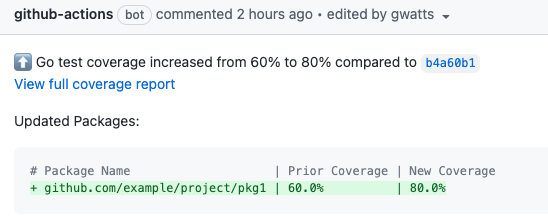

# Go Coverage Action

A Github action for generating test coverage reports for the Go programming language, that does not utilize third party services, making it suitable for use with private repos.

## Overview

This action will generate Go coverage reports for pull requests and other commits without using any third party services:  Nothing is uploaded anywhere, nor do any services need to access the repo to produce coverage and change reports.

The action stores previous coverage data as [git commit notes](https://git-scm.com/docs/git-notes) (in a separate namespace; not normally user-visible) associated with previous commits, so that they can be compared with changes in open pull requests.

It will generate a [job summary](https://github.blog/2022-05-09-supercharging-github-actions-with-job-summaries/) giving coverage statistics on each run and optionally add a comment noting any changes to pull requests:


## Usage

To operate effectively, this action **should be triggered on any push to the main branch**, so baseline coverage data can be tracked and referenced during pull requests.

The workflow:

1. On merge to `main`, the action runs `go test`, generates coverage data and attaches it to a [git note](https://git-scm.com/docs/git-notes) associated with the latest's commits' SHA.
2. When a pull request is opened the action generates new coverage data and calculates the delta based on the most recent commit to `main` that has coverage data attached.
3. The output of `go test` and `go tool cover` (report HTML and .cov files) and made available to other build steps on success.


Your subsequent steps can then publish the report HTML somewhere, save it as an artifact or generate report graphs etc.


### Example Comment




### Example Workflow

```yaml
name: "Go Coverage"
on:
  pull_request:
  push:
    branches:
      # It's important that the action also runs on merge to main
      - main

jobs:
  coverage:
    runs-on: ubuntu-latest
    steps:
    - uses: actions/checkout@v3
      with:
        # default fetch-depth is insufficent to find previous coverage notes
        fetch-depth: 10

    - uses: gwatts/go-coverage-action@v1
      id: coverage
      with:
        # Optional coverage threshold
        # use fail-coverage to determine what should happen below this threshold
        coverage-threshold: 80

        # collect coverage for all packages beyond the one under test
        cover-pkg: ./...

        # Ignore code-generated files when calculating coverage totals
        ignore-pattern: |
          \.pb\.go$
          \_string\.go$
        
        # A url that the html report will be accessible at, once your
        # workflow uploads it.  Used in the pull request comment.
        report-url: https://artifacts.example.com/go-coverage/${{ github.ref_name}}.html

    - name: Upload coverage to s3
      # ensure this runs regardless of whether the threshold is met using always()
      if: always() && steps.coverage.outputs.report-pathname != ''
      run: |
        aws s3 cp ${{ steps.coverage.outputs.report-pathname }} s3://artifacts.example.com-bucket/go-coverage/${{ github.ref_name}}.html
```


If you want to generate a badge to put in the readme, you could add an extra step to the workflow to create one.  For example using the [dynamic badges action](https://github.com/Schneegans/dynamic-badges-action):


```yaml
    - name: Update coverage badge
      uses: schneegans/dynamic-badges-action@v1.3.0
      if: github.ref_name == 'main'
      with:
        auth: ${{ secrets.COVERAGE_GIST_SECRET }}
        gistID: 788ds7a07299ab2728a33
        filename: coverage.json
        label: Go Coverage
        message: ${{ steps.coverage.outputs.coverage-pct }}%
        color: ${{ steps.coverage.outputs.meets-threshold == 'true' && 'green' || 'red' }}
```

If you want to generate a cool [tree map](https://github.com/nikolaydubina/go-cover-treemap) showing coverage by package:

```yaml
    name: Generate coverage tree map
    run: |
    	go run github.com/nikolaydubina/go-cover-treemap@latest \
          -coverprofile ${{ steps.coverage.outputs.gocov-agg-pathname }} \
          -only-folders=true >/tmp/treemap.svg
```


## Notes on cover-pkg

By default, Go calculates coverage information on a per-package basis.  e.g. If unit tests in `myrepo/pkg1` execute code in `myrepo/pkg2`, that side-effect coverage won't be reflected in the stats for `myrepo/pkg2` when its own tests are executed.  This is probably the "right thing" most of the time, when packages are expected to have unit tests that exercise their own code, not rely on other packages executing it as a side effect.

The `cover-pkg` option changes that behaviour so that side-effect coverage is also tracked and emitted.  The output from the `go test` tool when using the flag can be misleading, however as the coverage for each package is now reported as the coverage for whatever `cover-pkg` is set to - i.e. if it's set to `./...` (the whole tree) then even if `myrepo/pkg1` has 100% coverage of its own code, it's unlikely to also have 100% coverage of every package in the repo so its coverage number will be lower than might otherwise be expected.

This GitHub action changes the reporting behaviour so that per-package coverage is still reported as expected when `cover-pkg` is used.  e.g. if `myrepo/pkg1` has three methods and its own tests cover two of them and `myrepo/pkg2` happens to test the other as a side effect, then coverage of `myrepo/pkg1` will be reported as 100% if the `cover-pkg` option is used.
